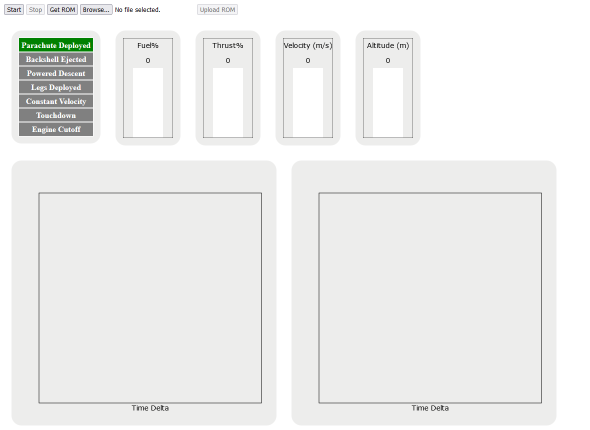
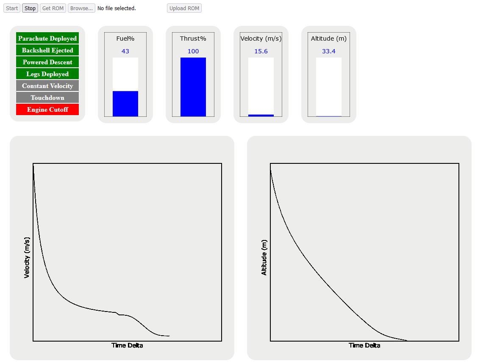
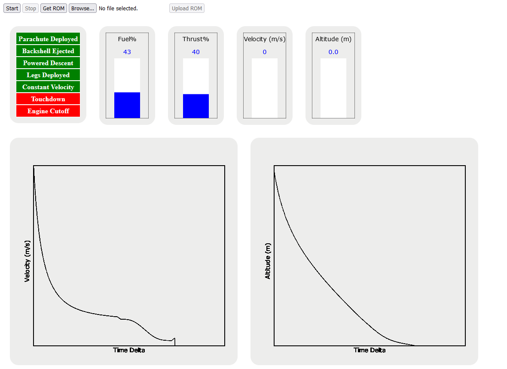
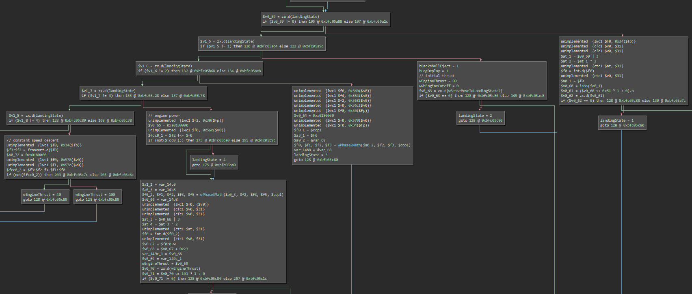
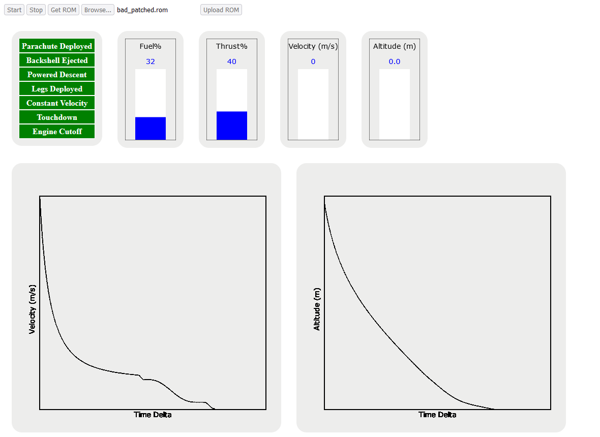

# Mars or Bust

When connecting to the challenge and handing in our ticket, we get a second IP/port to connect to. When connecting to that, we are presented with the following welcome text:

> You are an engineer supporting the Mars Polar Lander. The latest simulation data shows that the lander is going to crash on landing. Unfortunately, the lander launched 8 months ago and is close to the Red Planet already so there's not much time to reprogram the flight software. There is a small MIPS processor that controls the landing sequence that can be reprogrammed before its too late.
> 
> Use the simulator to figure out the problem, binary patch the controller firmware and resimulate for a successful landing to get your flag.

After that we get a sleek web interface with a number of indicators and controls reminiscent of a mission control terminal:

If we press the start button, a descent simulation commences. Everything looks like it's going to plan until at a height of a few dozen meters over the ground, the engine appears to be cut off:

Subsequently the lander crashes into the ground:

Our objective is to figure out the issue and patch the firmware, which is done by simply uploading a new file using the buttons near the top of the interface.

Searching up on the Mars Polar Lander, we find that it is a real mission which failed to land on Mars in 1999. The prevailing theory appears to be that the landing gear sent spurious input to the computer, leading it to cut off the engine. This seems consistent with what we observed in the simulation.

We download the ROM and load it up in Binary Ninja at some load address for lack of a better one. Binja auto-detects the arch as `mipsel32` as expected. We quickly identify that absolute jump instructions appear to target a base address of 0x0fc00000, although due to the format of MIPS `j` instructions, the top nibble of that address could be anything. Reloading the binary at that address, we make the assumption that the entrypoint is simply at the start of the image, which turns out to be correct. The startup code does the kinds of things you'd expect like zeroing out registers, and just before jumping to another function which we can presume to be `main`, it copies the section of memory at 0xbfc05efc through 0xbfc0649c to 0xa0180000. We can therefore deduce:
* the binary is loaded at 0xbfc00000, resolving the question of the high nibble
* the data being copied is likely a data section

We reload the binary one more time, mapping the main binary at 0xbfc00000 and this presumed data section at 0xa0180000. We're now ready to reverse engineer the image.

Having a look at the function we assumed to be `main` a minute ago (0xbfc05774), it's composed primarily of a big control loop that does vastly different things depending on the value of a variable, which is likely some kind of "phase counter" for the different stages of descent.

We can identify which stage corresponds to what actions in the landing by patching out the instructions that advance the phase counter. We identify the following:
* phase 0: unpowered descent
* phase 1: engine startup
* phase 2: engine control init
* phase 3: powered descent
* phase 4: constant velocity

Using this we can now start to map out how the firmware controls the lander. In particular we are interested in the engine controls. Phase 1 sets four variables. By patching out the writes to these and observing changes, we can figure out what they correspond to. While looking for the engine-related variables, we accidentally find the one responsible for deploying the landing gear. Crucially, we note that without the gear deployed, the engine does not anomalously shutdown while still in the air, lending credence to our theory of spurious landing gear input. Unfortunately a landing without deployed gear is still treated as a failure by the simulator.

This discovery giving newfound confidence in our theory, we look for the landing gear code since presumably the failure is there. One of the variables set in phase 1 is also used in some code common to all phases which consists of a series of branches checking a set of three similar variables followed by one last check. We theorize that this is the code for the landing gear which shuts off the engine. Looking up images of the Mars Polar Lander, it indeed has exactly three landing legs.

Disabling the write to this engine cutoff variable leads to the lander landing on the surface successfully, however the simulation does not accept the landing because the engine is still running. At this point we try a bunch of things, including patching out individual gear sensors to try and block out the spurious input, however every gear appears to send such input at least once.

Realizing that the spurious input occurs in phase 3, we patch the control flow code for that phase to skip over the engine cutoff code. Running the simulation again...

Success! The engine shuts down correctly upon landing and the server presents us with our flag.