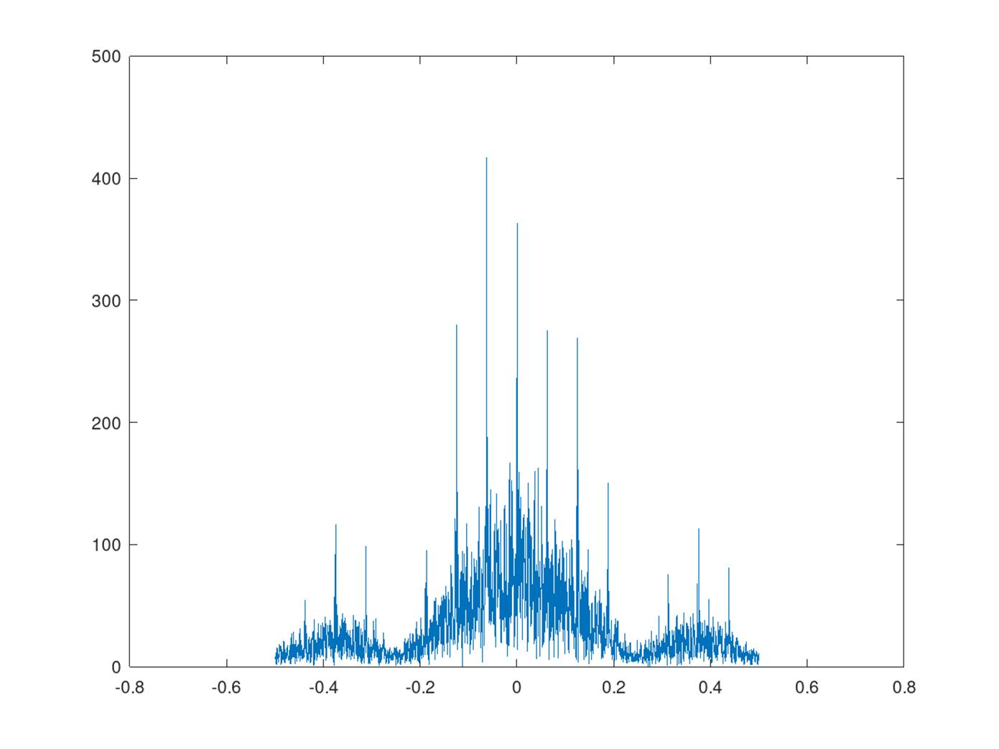
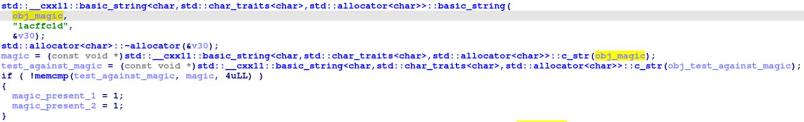
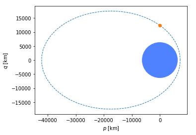
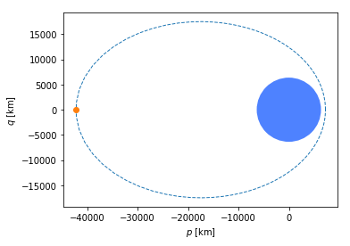
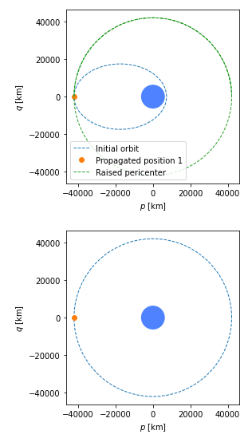

# Qualification Event Technical Paper

The following 5 write-ups were assembled by the Hack-a-Sat2 2021 team
SingleEventUpset.

# credence clearwater space data systems

  
**Category**: We're On the Same Wavelength

**Points**: 155

**Solves**: 21

**Description:**

We've captured this noisy IQ data from a satellite and need to decode it.
Figure out how to filter the noise while maintaining the signal
characteristics, then demodulate and decode the signal to get the flag. The
satellite is transmitting using asynchronous markers in CCSDS space packets
and an unknown modulation.

**Files:**

* <https://generated.2021.hackasat.com/noise/noise-romeo411892zulu2.tar.bz2>

## Write-up

_By Jason, part of the SingleEventUpset team_

The challenge provides one file: noise-romeo411892zulu2.tar.bz2 which is a
bzip2 compressed tarball archive. _The challenge is self-contained with the
flag residing in the demodulated data decoded as ASCII characters._

## Analysis

Extracting the file with standard file archive utilities (e.g., 7zip) yields a
single directory containing the file iqdata.txt. Viewing the file iqdata.txt
in a text editor shows that it contains plaintext floating-point complex in-
phase and quadrature (I/Q) samples in the format ivalue+qvaluej, which can be
directly read into many signal processing and analysis tools or scripting
languages. GNU Octave is used to process the data in this solution.

Viewing the power spectral density (shown in Figure 1) indicates that the
captured I/Q data is likely a variant of phase shift keying (PSK) or minimum
shift keying (MSK). Given that the problem statement refers to the CCSDS
standard, Quadrature Phase Shift Keying (QPSK) is the most likely candidate
and is used as a starting point for the analysis. Both standard QPSK and
differential QPSK (DQPSK) are analyzed.

We plot an eye diagram to get an estimate of the oversampling ratio (OSR) also
referred to as the number of samples per symbol (SPS). The SPS can be any
positive fractional/rational number, but to provide sufficient synchronization
fidelity and keep hardware complexity low, most communications systems use a
whole number (often a power of two) value for the SPS that is greater than or
equal to four. The eye diagram shown in Figure 2 confirms that the SPS for
this signal capture is four and that the assumption of PSK or differential PSK
(and not offset PSK or MSK) is likely correct as the I and Q eyes are aligned
in time with no offset.



Figure 1: Power Spectral Density of Captured Signal


Figure 2: Eye Diagram of Captured Signal

Given the integer oversample rate and lack of frequency error, by choosing an
appropriate starting sample it is possible to demodulate the data simply by
decimating by a factor of four, taking the sign of both I and Q samples to get
hard decision bits, interleaving the resulting I and Q hard decision bits, and
packing the bits into bytes before decoding them as ASCII characters. If the
QPSK assumption is correct _and_ if there is no forward error correction
coding applied to the data, then the remaining unknowns are the constellation
mapping and bit packing order. A QPSK (or DQPSK) modulation type is confirmed
by inspecting the constellation diagram shown in Figure 3.


Figure 3: Constellation Diagram of Captured Signal

The problem statement indicates that CCSDS framing markers are present in the
demodulated data. From the CCSDS specification ( _TM SYNCHRONIZATION AND
CHANNEL CODING_ ) the base ASM marker is given as 0x1ACFFC1D for uncoded data,
convolutional, Reed-Solomon, concatenated, rate-7/8 LDPC for Transfer Frame,
and all LDPC with SMTF stream coded data. If this ASM marker is found, then
the data _may_ be uncoded. If the data is uncoded, then the demodulated data
can be directly mapped to ASCII to find the flag. If a different CCSDS ASM
marker is found or if the demodulated data does not result in intelligible
ASCII characters, then the data is likely forward error correction coded and
additional decoding would be necessary to extract the flag. The solution given
below starts from the assumption that the data is uncoded and performs a
brute-force search of possible starting samples, constellation mappings and
bit (2-bit dibit) to byte packing orders. The flag is found using the above
assumptions (uncoded QPSK at four SPS), so no additional processing is
performed in this solution.

## Solution

1. Read in samples from the challenge file and plot the power spectral density and eye diagram for analysis. Use 4 samples per symbol based on eye diagram.

2. A delay-conjugate-multiply (DCM) operation is applied to perform differential demodulation but is not needed. The DCM operation is provided in the case that a standard QPSK demodulation did not yield intelligible results.

3. Decimate the input samples by 4. Verify QPSK (or DQPSK) assumption by inspecting constellation diagram.

4. Use GNU Octave�s built-in function �perms to find all permutations of a QPSK constellation (24 permutations found of the vector [0, 1, 2, 3]).

5. Loop over all constellation permutations. For each permutation, loop over all decimated samples, generating two hard decision bits (dibits) of data per decimated symbol based on the sign (signum function) of the I and Q data. Append dibits to create a bit vector of all demodulated, decoded data.

6. For a given permutation, loop over starting sample indices to find a sample index that results in a decodable ASM marker. Our solution found a decodable ASM marker and ASCII string using sample zero (zero based indexing) as the starting sample.

7. For a given permutation, attempt to pack 2-bit dibits into a byte in possible orders (4 possible dibit packing orders). Search each constellation permutation and dibit byte packing order for the ASM marker 0x1ACFFC1D

8. Once a hit occurs for an ASM marker match, map the bytes after the marker to ASCII and complete the search.

9. Print the ASCII characters found by the search and verify that a valid flag is produced. Our solution found a constellation mapping of [3, 0, 2, 1] and a direct dibit to byte packing (a byte contains dibits [0, 1, 2, 3] concatenated).

Here's the solution script:

```octave
#wotsw3
warning('off','all');
close all;
clear variables;

pkg load signal
pkg load communications

sig = dlmread('iqdata.txt');

% Look at baseband signal PSD
Fs = 1;
psdSig = abs(fftshift(fft(sig)));
freqs = linspace(-Fs/2, Fs/2, length(psdSig));
plot(freqs, psdSig);

eyediagram(sig, 8, 8);

sps = 4;

# DCM
jj = 1;
for ii = sps+1:1:length(sig)
  dcm(jj) = sig(ii) .* conj(sig(ii-sps));
  jj = jj + 1;
end

decimated = dcm(1:sps:end);

%scatterplot(decimated);
decimated = decimated .* exp(1i*pi/4);
%scatterplot(decimated);

decimated = sig(1:sps:end);
scatterplot(decimated);

asm = '1ACFFC1D';

% Search
ordvec = perms([0 1 2 3]);
stophere = 0;
for pskordering = 1:24
  % Inelegant way of making dibits
  dibits = [];
  for ii = 1:length(decimated)
    if (real(decimated(ii)) > 0 && imag(decimated(ii)) > 0)
      dibits = [dibits; de2bi(ordvec(pskordering,1), 2)'];
    elseif (real(decimated(ii)) < 0 && imag(decimated(ii)) > 0)
      dibits = [dibits; de2bi(ordvec(pskordering,2), 2)'];
    elseif (real(decimated(ii)) < 0 && imag(decimated(ii)) < 0)
      dibits = [dibits; de2bi(ordvec(pskordering,3), 2)'];
    else
      dibits = [dibits; de2bi(ordvec(pskordering,4), 2)'];
    end
  end

  for startidx = 1:200
    tdibits = dibits(startidx:end);
    tdibits = tdibits(1:8*floor(length(tdibits)/8));
    % 1st group
    bytes = reshape(tdibits, length(tdibits)/8, 8);
    bytesint = bi2de(bytes);
    temp = dec2hex(bytesint);
    temp2 = [];
    for kk = 1:length(temp)
     temp2 = [temp2 temp(kk, :)];
    end
    if (strfind(temp2, asm))
      eng = char(bytesint);
      stophere = 1;
      break;
    end
    % 2nd group
    bytes = reshape(tdibits, length(tdibits)/8, 8);
    bytesint = bi2de(fliplr(bytes));
    temp = dec2hex(bytesint);
    temp2 = [];
    for kk = 1:length(temp)
     temp2 = [temp2 temp(kk, :)];
    end
    if (strfind(temp2, asm))
      eng = char(bytesint);
      stophere = 1;
      break;
    end
    % 3rd group
    bytes = reshape(tdibits, 8, length(tdibits)/8)';
    bytesint = bi2de(bytes);
    temp = dec2hex(bytesint);
    temp2 = [];
    for kk = 1:length(temp)
     temp2 = [temp2 temp(kk, :)];
    end
    if (strfind(temp2, asm))
      eng = char(bytesint);
      stophere = 1;
      break;
    end
    % 4th group
    bytes = reshape(tdibits, 8, length(tdibits)/8)';
    bytesint = bi2de(fliplr(bytes));
    temp = dec2hex(bytesint);
    temp2 = [];
    for kk = 1:length(temp)
     temp2 = [temp2 temp(kk, :)];
    end
    if (strfind(temp2, asm))
      eng = char(bytesint);
      stophere = 1;
      break;
    end
    %eng = char(bytesint);
  end
  if (stophere)
    break;
  end
end
eng = eng(11:end).';

```

Running the script results in the flag:

    flag{romeo411892zulu2:GCJSuvoUNCfNac5IhmMbREXHCFIDSHF5Qx5Eb1y-q91U13ejpyzgbL6Xzsk0RsWeIvMm5HA-yje067iYz70MxzY}  
    
    

# Take Out the Trash

  
**Category**: Deck 36, Main Engineering

**Points**: 142

**Solves**: 24

**Description:**

A cloud of space junk is in your constellation's orbital plane. Use the space
lasers on your satellites to vaporize it! Destroy at least 51 pieces of space
junk to get the flag.

The lasers have a range of 100 km and must be provided range and attitude to
lock onto the space junk. Don't allow any space junk to approach closer than
10 km.

Command format:
    
    [Time_UTC] [Sat_ID] FIRE [Qx] [Qy] [Qz] [Qw] [Range_km]
    
    
     

Command example:

    
    
    2021177.014500 SAT1 FIRE -0.7993071278793108 0.2569145028089314 0.0 0.5432338847750264 47.85760531563315
    
    
     

This command fires the laser from Sat1 on June 26, 2021 (day 177 of the year)
at 01:45:00 UTC and expects the target to be approximately 48 km away. The
direction would be a [0,0,1] vector in the J2000 frame rotated by the provided
quaternion [-0.7993071278793108 0.2569145028089314 0.0 0.5432338847750264] in
the form [Qx Qy Qz Qw].

One successful laser command is provided for you (note: there are many
possible combinations of time, attitude, range, and spacecraft to destroy the
same piece of space junk):

    
    
    2021177.002200 SAT1 FIRE -0.6254112512084177 -0.10281341941423379 0.0 0.773492189779751 84.9530354564239
    
    
     

**Ticket:**

    
    
    ticket{mike202103bravo2:GE8s0nQV-5AuI3AlQRECYw5t0R6DqtrN5yS9I4czUwfqTiTB6d7a625ki8wzxDnuWA}
    
    
     

**Connecting:**

    
    
    hard-coal.satellitesabove.me:5007
    
    
     

**Files:**

* <https://static.2021.hackasat.com/hxch0sjllud2ph3ff2dqg80dajn4>

* <https://static.2021.hackasat.com/n47ad4ilw8r88gxpfm96bx0dyt2s>

## Write-up

_By Kevin Farley, part of the SingleEventUpset team_

In-line with prior Hack-a-Sat problems, we ultimately needed to do some
quaternion calculations. The prompt had provided trajectory data for �space
junk which we need to destroy, as well as satellites which do the destroying.
The solution needed to provide firing information which could destroy 51
pieces of space junk and prevent any from getting too close. Relevant
parameters include the UTC timestamp (indexing into the trajectory data) and
the quaternion displacement from the J2000 frame [0,0,1].

### Approach

Our general approach was to first detect when space junk was in range of our
satellites. From that point we needed to calculate the quaternions, and then
format commands to clear out the debris. This was an iterative process; but
rather than providing snippets, the process will be laid out here and the
final code will be documented in the �Code subsection.

During the process we trialed a few different modules to do our calculations
and interactions. In the end, the team used Python3 alongside the skyfield and
numpy python packages.

Note that we have two code artifacts: one which generates commands for the
satellites ( _generate_commands.py_ ) _,_ and the other which feeds a list of
commands (via file) to the hack-a-sat problem ( _send_commands.py_ ). The
final subsection documents the solution output resulting in the flag.

### Process

The first step was to import the provided TLE data into the skyfield python
package. From this point, we wrote code to detect when space junk was within
firing range. This is possible by indexing into the TLE data with a time
iteration loop. For each time increment we check the various satellite and
space junk positions per the skyfield API. A time increment of one minute was
selected as it generated commands in a reasonable amount of time without
allowing any of the junk within 10km of any of the satellites.

After detecting some possible timestamps to fire at the junk, we took a stab
at calculating the quaternions and drafting some commands. We quickly ran into
2 issues.

1.      Satellites have a cool down period

2.      Our quaternion calculations were missing their mark

The first point was solved by drafting some logic to track satellite
availability. For any given time increment, we created a list of available
satellites. If a command was generated for a given satellite, it was removed
temporarily from the list of available satellites. Each satellite was returned
to its available state at the start of the next time increment.

The second point was a bit more convoluted. Our original approach was to use
scipy�s spatial transform submodule. More specifically, the Rotation class
and align_vectors method. Some code was developed to heighten our degree of
confidence, however we still had issues.

To find the solution, we had to take a step back. It seemed prudent to try to
re-produce the quaternion provided in the prompt. As that command was verified
to work, we figured that if we could programmatically reproduce it, then we
could plug it in to the existing code for a valid solution. After trying a
variety of inputs and modules, we ultimately ended up using some math from
earlier in the CTF�Deck 36�s first problem. We took the difference of
satellite 1 and the known space junk, then normalized the vector and plugged
it into the quaternion calculation previously mentioned. This finally provided
the quaternion we were looking for and is notated in the quad function of the
solution code ( _generate_commands.py_ ).

Later analysis showed that even though the angle between our
�scipy.spatial.transform.Rotation� solution and the accepted solution was
exactly 0 degrees, the grading system was only accepting a quaternion which
used the minimum angular rotation between [0,0,1] and the target angle. The
problem was that the grading system was comparing the _quaternions_ rather
than the _pointing vector resulting from applying the quaternion_. The problem
was underconstrained because it did not specify a second alignment vector.
Therefore, it has an infinite number of valid quaternions that are correctly
pointing at the space junk but with different values for the �roll of the
satellite (aka which way is �up� while you are pointing at the space
junk). However, it was only accepting one specific quaternion solution. We
eventually figured out the issue with the scoring and were able to work around
it by manually constructing the quaternions after reverse-engineering the
algorithm used to compute the example quaternion.

### Code

#### generate_commands.py

```python
from math import dist
from skyfield.api import load
from astropy import coordinates as coord
from astropy import units as u
from astropy.time import Time
from astropy.utils import iers
from scipy.spatial.transform import Rotation
from skyfield.units import Distance
import numpy as np
from scipy.spatial.transform import *

SPACEJUNK_FILE = 'spacejunk.tle'
SATS_FILE = 'sats.tle'
TO_KILL = 51

sats = load.tle_file(SATS_FILE)
spacejunk = load.tle_file(SPACEJUNK_FILE)

ts = load.timescale()
time_iter = 0
detected_junk = {}
available_sats = [sat.name for sat in sats]


# [Time_UTC]    [Sat_ID] FIRE [Qx]              [Qy]                [Qz] [Qw]               [Range_km]
# 2021177.002200 SAT1 FIRE -0.6254112512084177 -0.10281341941423379 0.0 0.773492189779751 84.9530354564239
def fmt_cmd(utc, sat, qx, qy, qz, qw, range_km):
    '''usage: fmt_cmd(t, sat, qx, qy, qz, qw, distance)'''
    return f'{utc.utc_strftime("%Y%j.%H%M%S")} {sat.name.upper()} FIRE {qx} {qy} {qz} {qw} {range_km}'


def quad(vec):
    v1 = [0,0,1]
    v2 = vec
    x, y, z = np.cross(v1, v2)
    w = 1 + np.dot(v1, v2)
    v3 = [x, y, z, w]
    norm_len = np.sum([_i**2 for _i in v3])
    norm_sf = 1 / np.sqrt(norm_len)
    return [norm_sf * _i for _i in v3]


with open('cmds.txt', 'w') as f:
    # Kill only as many as we need to
    while len(detected_junk.keys()) < TO_KILL:
        current_time = ts.utc(2021, 6, 26, 0, time_iter)
        for junk in spacejunk:
            current_junk_pos = junk.at(current_time)
            for sat in sats:
                if sat.name in available_sats:
                    current_sat_pos = sat.at(current_time)
                    distance = (current_sat_pos - current_junk_pos).distance().km
                    if distance <= 10 and junk.name not in detected_junk.keys():
                        print(f'{current_time.utc_datetime()}  {junk.name} is TOO CLOSE TO {sat.name} ({distance} km)')
                    elif distance <= 90:
                        #print(f'{current_time.utc_datetime()}  {junk.name} is in range of {sat.name} ({distance} km)')
                        if not detected_junk.get(junk.name) and sat.name in available_sats:
                            detected_junk[junk.name] = (sat.name, current_time.utc_datetime())
                            available_sats.remove(sat.name)

                            junk_vec = np.array((current_junk_pos - current_sat_pos).position.km)
                            junk_vec = junk_vec / np.linalg.norm(junk_vec)
                            fin = quad(junk_vec)

                            f.write(fmt_cmd(current_time, sat, fin[0], fin[1], fin[2], fin[3], distance) + '\n')
                        # print(len(detected_junk.keys()))
        available_sats = [sat.name for sat in sats]
        time_iter += 1
print(time_iter)
print(len(detected_junk.keys()))
print(detected_junk)
```
     

#### send_commands.py
```python
from pwn import *

TICKET = b'ticket{mike202103bravo2:GE8s0nQV-5AuI3AlQRECYw5t0R6DqtrN5yS9I4czUwfqTiTB6d7a625ki8wzxDnuWA}'
HOST = b'hard-coal.satellitesabove.me'
PORT = 5007

conn = remote(HOST, PORT)
conn.recvuntil(b'Ticket please:')
conn.send(TICKET + b'\n')
conn.recvuntil(b'Provide command sequences:')
with open('cmds.txt', 'rb') as file:
    for i in range (0,52):
        print(f'Sending {i}')
        print(conn.recvuntil(b':'))
        ln = file.readline()
        print(ln)
        conn.send(ln)

conn.interactive()
```
    
    
     

### Solution

After running _generate_commands.py_ against the provided trajectory data, we
generated a _cmds.txt_ which got fed to _send_commands.py_. This led to the
following result:

```
All commands entered.

Starting command sequence.
2021-06-26 00:22:00 UTC: Executing Command ['2021177.002200', 'SAT1', 'FIRE', -0.6254112512084178, -0.10281341941423386, 0.0, 0.7734921897797508, 84.9530354564241]
SpaceJunk1 was destroyed by Sat1!
2021-06-26 00:23:00 UTC: Executing Command ['2021177.002300', 'SAT1', 'FIRE', -0.5884325821129802, -0.07578329796390694, 0.0, 0.804986948998283, 73.79197663512058]
SpaceJunk7 was destroyed by Sat1!
2021-06-26 00:24:00 UTC: Executing Command ['2021177.002400', 'SAT1', 'FIRE', -0.4869261506899539, -0.32189226288414363, 0.0, 0.8119656980868032, 65.72272043204177]
SpaceJunk8 was destroyed by Sat1!
2021-06-26 00:25:00 UTC: Executing Command ['2021177.002500', 'SAT1', 'FIRE', -0.24912653228890722, -0.4139360802232342, 0.0, 0.8755529066819026, 84.68927310689409]
SpaceJunk9 was destroyed by Sat1!
2021-06-26 00:26:00 UTC: Executing Command ['2021177.002600', 'SAT1', 'FIRE', -0.36174277753666884, -0.4195492482845058, 0.0, 0.8325386424448791, 39.37750883546023]
SpaceJunk10 was destroyed by Sat1!
2021-06-26 00:27:00 UTC: Executing Command ['2021177.002700', 'SAT1', 'FIRE', -0.4471875965118009, -0.33931543232555356, 0.0, 0.8275797791824796, 26.948742701290044]
SpaceJunk11 was destroyed by Sat1!
2021-06-26 00:28:00 UTC: Executing Command ['2021177.002800', 'SAT1', 'FIRE', 0.08400059410017914, -0.4655396945472299, 0.0, 0.8810316072603123, 86.39474712140971]
SpaceJunk2 was destroyed by Sat1!
2021-06-26 00:29:00 UTC: Executing Command ['2021177.002900', 'SAT1', 'FIRE', 0.3234201456560628, -0.5144999650954043, 0.0, 0.7941594268789102, 83.0942159316515]
SpaceJunk13 was destroyed by Sat1!
2021-06-26 00:30:00 UTC: Executing Command ['2021177.003000', 'SAT1', 'FIRE', 0.26918524327744797, -0.43652778189286834, 0.0, 0.8584770238261205, 77.39007535348169]
SpaceJunk15 was destroyed by Sat1!
2021-06-26 00:31:00 UTC: Executing Command ['2021177.003100', 'SAT1', 'FIRE', -0.0615878054213333, 0.6893017431564414, 0.0, 0.7218518193541356, 57.834407224767965]
SpaceJunk32 was destroyed by Sat1!
2021-06-26 00:32:00 UTC: Executing Command ['2021177.003200', 'SAT1', 'FIRE', 0.0054830829815700555, 0.6710459978192034, -0.0, 0.7413954441536897, 48.33874973453497]
SpaceJunk33 was destroyed by Sat1!
2021-06-26 00:33:00 UTC: Executing Command ['2021177.003300', 'SAT1', 'FIRE', 0.6507804691428596, -0.08582892062107254, 0.0, 0.7543992161761711, 60.32350911822143]
SpaceJunk35 was destroyed by Sat1!
2021-06-26 00:34:00 UTC: Executing Command ['2021177.003400', 'SAT1', 'FIRE', 0.6861510510107066, 0.1683076970645573, -0.0, 0.7077211698866496, 82.21329809031677]
SpaceJunk36 was destroyed by Sat1!
2021-06-26 00:35:00 UTC: Executing Command ['2021177.003500', 'SAT1', 'FIRE', 0.46861707592146146, 0.35520845871669043, -0.0, 0.808841756470901, 48.617026659592675]
SpaceJunk38 was destroyed by Sat1!
2021-06-26 00:36:00 UTC: Executing Command ['2021177.003600', 'SAT1', 'FIRE', 0.6056665571945372, 0.27240901772752646, -0.0, 0.7476371770831362, 70.16001749447351]
SpaceJunk43 was destroyed by Sat1!
2021-06-26 00:37:00 UTC: Executing Command ['2021177.003700', 'SAT1', 'FIRE', 0.45001039371089757, 0.5227096515909513, -0.0, 0.7240616449487084, 67.79131969306351]
SpaceJunk51 was destroyed by Sat1!
2021-06-26 01:08:00 UTC: Executing Command ['2021177.010800', 'SAT1', 'FIRE', 0.7136891814681181, 0.44162647125236676, -0.0, 0.5437037908131136, 88.23435230553797]
SpaceJunk53 was destroyed by Sat1!
2021-06-26 01:11:00 UTC: Executing Command ['2021177.011100', 'SAT1', 'FIRE', 0.5969146906502469, 0.5765527701891414, -0.0, 0.5579245067866682, 89.9415764480569]
SpaceJunk18 was destroyed by Sat1!
2021-06-26 01:12:00 UTC: Executing Command ['2021177.011200', 'SAT1', 'FIRE', 0.6561700144133926, 0.5052066818971347, -0.0, 0.5605418099938806, 89.48494363698845]
SpaceJunk12 was destroyed by Sat1!
2021-06-26 01:13:00 UTC: Executing Command ['2021177.011300', 'SAT1', 'FIRE', 0.6239380253020991, 0.5942102467852098, -0.0, 0.5075583938795392, 86.42896794104807]
SpaceJunk16 was destroyed by Sat1!
2021-06-26 01:14:00 UTC: Executing Command ['2021177.011400', 'SAT1', 'FIRE', 0.5494423649369218, 0.6139103096386115, -0.0, 0.5667691058375948, 82.0866721890363]
SpaceJunk44 was destroyed by Sat1!
2021-06-26 01:15:00 UTC: Executing Command ['2021177.011500', 'SAT1', 'FIRE', 0.5484123779774783, 0.5979017342735572, -0.0, 0.5846001880206335, 79.40277617021908]
SpaceJunk58 was destroyed by Sat1!
2021-06-26 01:26:00 UTC: Executing Command ['2021177.012600', 'SAT1', 'FIRE', -0.2747211413577219, 0.7447792832306693, 0.0, 0.608138235733884, 86.4279343626737]
SpaceJunk48 was destroyed by Sat1!
2021-06-26 01:28:00 UTC: Executing Command ['2021177.012800', 'SAT1', 'FIRE', 0.03299168298605353, 0.8082240383870652, -0.0, 0.5879502127111202, 88.52567588314837]
SpaceJunk17 was destroyed by Sat1!
2021-06-26 01:29:00 UTC: Executing Command ['2021177.012900', 'SAT1', 'FIRE', 0.03647720497886061, 0.7933128367321448, -0.0, 0.6077204592515606, 86.72051245174403]
SpaceJunk47 was destroyed by Sat1!
2021-06-26 01:57:00 UTC: Executing Command ['2021177.015700', 'SAT2', 'FIRE', -0.6752576082143226, -0.17550190726309378, 0.0, 0.7163981037772844, 83.2576964609835]
SpaceJunk30 was destroyed by Sat2!
2021-06-26 01:58:00 UTC: Executing Command ['2021177.015800', 'SAT2', 'FIRE', -0.5603883895130868, -0.19400571045372497, 0.0, 0.8051873305077982, 64.10989542741625]
SpaceJunk42 was destroyed by Sat2!
2021-06-26 01:59:00 UTC: Executing Command ['2021177.015900', 'SAT2', 'FIRE', -0.22535974574361753, -0.46694592509109367, 0.0, 0.8550874154372727, 84.92552252225155]
SpaceJunk40 was destroyed by Sat2!
2021-06-26 02:00:00 UTC: Executing Command ['2021177.020000', 'SAT2', 'FIRE', -0.294733399272882, -0.4416640824873598, 0.0, 0.8473871969729366, 82.94699268947561]
SpaceJunk5 was destroyed by Sat2!
2021-06-26 02:01:00 UTC: Executing Command ['2021177.020100', 'SAT2', 'FIRE', -0.03708570518086816, -0.5712958855221474, 0.0, 0.8199058858531894, 82.4930428013585]
SpaceJunk24 was destroyed by Sat2!
2021-06-26 02:02:00 UTC: Executing Command ['2021177.020200', 'SAT2', 'FIRE', 0.1380456591521742, -0.5536150654226595, 0.0, 0.8212513350529824, 68.8253131339525]
SpaceJunk41 was destroyed by Sat2!
2021-06-26 02:03:00 UTC: Executing Command ['2021177.020300', 'SAT2', 'FIRE', -0.4895000733942992, 0.5269028455968172, 0.0, 0.6948115352014185, 44.70545840147413]
SpaceJunk52 was destroyed by Sat2!
2021-06-26 02:04:00 UTC: Executing Command ['2021177.020400', 'SAT2', 'FIRE', -0.2998776123954696, 0.43106825363378787, 0.0, 0.8510308915034219, 30.251513871721684]
SpaceJunk55 was destroyed by Sat2!
2021-06-26 02:05:00 UTC: Executing Command ['2021177.020500', 'SAT2', 'FIRE', 0.12552603344726526, -0.4919954757182805, 0.0, 0.8615008222861652, 89.18592559600607]
SpaceJunk3 was destroyed by Sat2!
2021-06-26 02:06:00 UTC: Executing Command ['2021177.020600', 'SAT2', 'FIRE', -0.07450580583884571, -0.43345182375656455, 0.0, 0.8980915328508626, 51.841578965802285]
SpaceJunk56 was destroyed by Sat2!
2021-06-26 02:07:00 UTC: Executing Command ['2021177.020700', 'SAT2', 'FIRE', 0.2889142256689078, -0.5100303723101726, 0.0, 0.8101836764137391, 89.18550611323144]
SpaceJunk29 was destroyed by Sat2!
2021-06-26 02:08:00 UTC: Executing Command ['2021177.020800', 'SAT2', 'FIRE', 0.5648076092217571, 0.3065755491496923, -0.0, 0.7661617304647679, 55.935388958630064]
SpaceJunk57 was destroyed by Sat2!
2021-06-26 02:22:00 UTC: Executing Command ['2021177.022200', 'SAT2', 'FIRE', 0.6914029906996595, -0.03234242103203408, 0.0, 0.721745018862862, 89.55415995269856]
SpaceJunk26 was destroyed by Sat2!
2021-06-26 02:33:00 UTC: Executing Command ['2021177.023300', 'SAT2', 'FIRE', 0.7154433611439959, 0.2543736238897263, -0.0, 0.6507187230011057, 89.52187283080339]
SpaceJunk6 was destroyed by Sat2!
2021-06-26 02:36:00 UTC: Executing Command ['2021177.023600', 'SAT2', 'FIRE', 0.6907734625128628, 0.30920863258848374, -0.0, 0.6536222494841732, 89.9864241086128]
SpaceJunk54 was destroyed by Sat2!
2021-06-26 02:56:00 UTC: Executing Command ['2021177.025600', 'SAT2', 'FIRE', 0.361912641706184, 0.6977292182479822, -0.0, 0.6182177430131807, 89.6208261810655]
SpaceJunk4 was destroyed by Sat2!
2021-06-26 04:20:00 UTC: Executing Command ['2021177.042000', 'SAT3', 'FIRE', 0.5279721184051023, 0.56017643295972, -0.0, 0.6383163840474042, 87.54089936717507]
SpaceJunk49 was destroyed by Sat3!
2021-06-26 04:25:00 UTC: Executing Command ['2021177.042500', 'SAT3', 'FIRE', 0.5234170404002645, 0.6205048399572307, -0.0, 0.5839591984105391, 88.89012954663097]
SpaceJunk14 was destroyed by Sat3!
2021-06-26 04:27:00 UTC: Executing Command ['2021177.042700', 'SAT3', 'FIRE', 0.4257893828348767, 0.6470118221787716, -0.0, 0.6325180656914082, 89.06939088459058]
SpaceJunk21 was destroyed by Sat3!
2021-06-26 05:16:00 UTC: Executing Command ['2021177.051600', 'SAT4', 'FIRE', 0.19834367382240853, -0.5213088163002396, 0.0, 0.8299981356016848, 89.35467700630174]
SpaceJunk22 was destroyed by Sat4!
2021-06-26 10:32:00 UTC: Executing Command ['2021177.103200', 'SAT6', 'FIRE', -0.18087718037479708, -0.5810222496931879, 0.0, 0.7935342405851998, 89.5820723806052]
SpaceJunk46 was destroyed by Sat6!
2021-06-26 11:34:00 UTC: Executing Command ['2021177.113400', 'SAT8', 'FIRE', 0.29550717110658353, -0.4862361124254691, 0.0, 0.8223441826862709, 87.68415391575954]
SpaceJunk20 was destroyed by Sat8!
2021-06-26 11:35:00 UTC: Executing Command ['2021177.113500', 'SAT8', 'FIRE', 0.36021705289485373, -0.5149342151778231, 0.0, 0.7778730158855914, 89.96240090115249]
SpaceJunk59 was destroyed by Sat8!
2021-06-26 13:08:00 UTC: Executing Command ['2021177.130800', 'SAT9', 'FIRE', 0.28829484039566855, -0.5319640164778292, 0.0, 0.7961786044437591, 89.82297090834531]
SpaceJunk19 was destroyed by Sat9!
2021-06-26 15:15:00 UTC: Executing Command ['2021177.151500', 'SAT9', 'FIRE', -0.30858758605204245, -0.542948224126228, 0.0, 0.78101275767605, 89.52624619845814]
SpaceJunk39 was destroyed by Sat9!
2021-06-26 21:22:00 UTC: Executing Command ['2021177.212200', 'SAT13', 'FIRE', -0.6037279556157091, -0.312185990501354, 0.0, 0.7335205947638859, 88.4781101257495]
SpaceJunk25 was destroyed by Sat13!
51 pieces of space junk have been vaporized! Nice work!
flag{mike202103bravo2:GKWRH1pD6AWlggKBLF6_l01uNdD-OKe8C6-U0VhZvdrBILfyorAy7gypmWIrExv4BNexh1ToFzP1R-9r-28dn5c}

```

# groundead

  
**Category**: Presents from Marco

**Points**: 80

**Solves**: 52

**Description:**

you're groundead

**Ticket:**

    
    
    ticket{kilo440990lima2:GMO6e_EYV3j23LQr2poHR_irrW4KpK-BjZ1rdGhinKKGYtUYRi46VXtZOOd-NGGGtQ}
    
    
     

**Connecting:**

    
    
    unfair-cookie.satellitesabove.me:5001
    
    
     

**Files:**

* <https://static.2021.hackasat.com/mai9wvewp0avwos5ppxbg6lqdb6i>

## Write-up

_By Jonathan, part of the SingleEventUpset team_

We used IDA Pro to disassemble and decompile the challenge binary. We
identified that main() starts a producer thread (getSatellitePacketBytes) and
a consumer thread (processSatellitePacketBytes):


getSatellitePacketBytes() processes incoming bytes and, among other things,
enforces that the incoming command ID always be set to 7.� Otherwise, it
rejects the input and prints "That sequence of hex characters did not work.
Try again." to stdout.

In processSatellitePacketBytes() we see that the max command ID is 8.
Interestingly, compared to IDA Pro, Ghidra provided a more useful
decompilation of the command handler logic:


We can see that the command nominally executed (7) corresponds to the
�Handling Test Telemetry command, which matches the output that we regularly
see when fuzzing stdin.

To accelerate local testing/debugging, we patched the challenge binary to
remove sleeps/delays.

The goal must be to find a way to execute command ID 8 to coerce the flag to
be dumped.

Immediately, we assume that we must abuse the queuing mechanism to inject a
single command, causing the parser to think that there are two commands
queued. We noticed that the magic hex value "1acffc1d" was being used in
getSatellitePacketBytes() as a delimiter between successive commands:


...


This magic value is significant for its use in CCSDS and ASM (see also
credence clearwater space data systems).

The same magic value was being used in processSatellitePacketBytes():



Some cursory reverse engineering reveals that the magic hex value "1acffc1d"
seems to be inserted between incoming commands by getSatellitePacketBytes()
and used by processSatellitePacketBytes() to delimit successive commands.

Our attempts then center around abusing the queuing mechanism to inject a
single command, causing the consumer to think that there are two commands
queued. This requires the use of the magic hex value "1acffc1d" as the
delimiter between successive commands. The first command is built to pass all
necessary checks (command 7), then the delimiter "1acffc1d", then the command
that we want to execute (command 8).

This results in the following sequence:

`0f ff 56 01 071acffc1d0f 01 01 01 08`

Note, while the parsed bytes expect to be separated by spaces, the delimiter
itself does not have such limitations.

We used pwntools to script the solution. Here's the solution script:

```python
#!/usr/bin/python3

from pwn import *

TICKET = b'ticket{kilo440990lima2:GMO6e_EYV3j23LQr2poHR_irrW4KpK-BjZ1rdGhinKKGYtUYRi46VXtZOOd-NGGGtQ}'
HOST = b'unfair-cookie.satellitesabove.me'
PORT = 5001

conn = remote(HOST, PORT)
conn.recvuntil(b'Ticket please:')
conn.send(TICKET + b'\n')

conn.recvuntil(b'>')
conn.send(b'0f ff 56 01 071acffc1d0f 01 01 01 08\n')

conn.interactive()
```    
     

After running this script, there is a short delay before the flag is dumped.


# Fiddlin' John Carson

  
**Category**: Guardians of the&hellip;

**Points**: 22

**Solves**: 232

**Description:**

Where do you come from?

**Ticket:**

    
    
    ticket{whiskey465080romeo2:GCw2dSO4sBTqMsnCePG9DksVFzZTwjAt2f_6WzKFqfHOakXfx1xpazWSxHu3H8Iusg}
    
    
     

**Connecting:**

    
    
    derived-lamp.satellitesabove.me:5013
    
    
     

## Write-up

_By Irsyad, part of the SingleEventUpset team_

Upon connecting to the challenge server, we are prompted with the scenario:

```
Your spacecraft reports that its Cartesian ICRF position (km) and velocity (km/s) are:
Pos (km):   [8449.401305, 9125.794363, -17.461357]
Vel (km/s): [-1.419072, 6.780149, 0.002865]
Time:       2021-06-26-19:20:00.000-UTC

What is its orbit (expressed as Keplerian elements a, e, i, Ω, ω, and υ)?
Semimajor axis, a (km):
Eccentricity, e:
Inclination, i (deg):
Right ascension of the ascending node, Ω (deg):
Argument of perigee, ω (deg):
True anomaly, υ (deg):
```    
     

Using the python libraries `orbitalpy` and `astropy`, we can convert
this state vector into Keplerian elements.

```python
#!/usr/bin/python3

import orbital
import astropy
r = orbital.utilities.Position(8449.401305 * 1000, 9125.794363 * 1000, -17.461357 * 1000)
v = orbital.utilities.Velocity(-1.419072 * 1000, 6.780149 * 1000, 0.002865 * 1000)
t = astropy.time.Time("2021-6-26T19:20:00", format='isot', scale='utc')
cur_orbit = orbital.elements.KeplerianElements.from_state_vector(r, v, orbital.bodies.earth, ref_epoch=t)
print(cur_orbit)
print(“True anomaly: {}”.format(cur_orbit.f * (180/math.pi)))
```
    
Running this script gives us the output:

```
KeplerianElements:
    Semimajor axis (a)                           =  24732.886 km
    Eccentricity (e)                             =      0.706807
    Inclination (i)                              =      0.1 deg
    Right ascension of the ascending node (raan) =     90.2 deg
    Argument of perigee (arg_pe)                 =    226.6 deg
    Mean anomaly at reference epoch (M0)         =     16.5 deg
    Period (T)                                   = 10:45:09.999830
    Reference epoch (ref_epoch)                  = 2021-06-26T19:20:00.000
        Mean anomaly (M)                         =     16.5 deg
        Time (t)                                 = 0:00:00
        Epoch (epoch)                            = 2021-06-26T19:20:00.000
True anomaly: 90.3899549735688
```

Which we can enter into the challenge prompt (note: precision differs due to
manual conversion of units. We used the Python REPL originally which printed
the elements in meters and radians):

```
What is its orbit (expressed as Keplerian elements a, e, i, Ω, ω, and υ)?
Semimajor axis, a (km): $ 24732.88581614663
Eccentricity, e: $ 0.7068070225889074
Inclination, i (deg): $ 0.11790360842536694308
Right ascension of the ascending node, Ω (deg): $ 90.226503799786584636
Argument of perigee, ω (deg): $ 226.58745907033403455
True anomaly, υ (deg): $ 90.389954973793024351

You got it! Here's your flag:
flag{whiskey465080romeo2:GGg7PfaGYc7h-168SHX2mppVwWZZ2nTVKg6AUN4bzH9w-TQV2X8ou3qiomPLaCJwIvtMBkZ6RXbH2z4dP2UTtS4}
```

# Cotton Eye GEO

  
**Category**: Guardians of the&hellip;

**Points**: 82

**Solves**: 50

**Description:**

Where do you go?

**Ticket:**

    
    
    ticket{charlie631677foxtrot2:GKm5yZpkXYc6ZtiLirUG0GNE4o0RV33HrYP3wj2Yu_UQwGKCDCd2paizAv00mmZa-A}
    
    
     

**Connecting:**

    
    
    visual-sun.satellitesabove.me:5014
    
    
     

## Write-up

_By Irsyad, part of the SingleEventUpset team_

Upon connecting to the challenge server, we are prompted with the scenario:

```
What is its orbit (expressed as Keplerian elements a, e, i, Ω, ω, and υ)?
Semimajor axis, a (km): $ 24732.88581614663
Eccentricity, e: $ 0.7068070225889074
Inclination, i (deg): $ 0.11790360842536694308
Right ascension of the ascending node, Ω (deg): $ 90.226503799786584636
Argument of perigee, ω (deg): $ 226.58745907033403455
True anomaly, υ (deg): $ 90.389954973793024351

You got it! Here's your flag:
flag{whiskey465080romeo2:GGg7PfaGYc7h-168SHX2mppVwWZZ2nTVKg6AUN4bzH9w-TQV2X8ou3qiomPLaCJwIvtMBkZ6RXbH2z4dP2UTtS4}

```
     

We will be building off the script created in the previous problem. To get a
better idea on where we are, we can use the �orbitalpy library to plot our
current orbit:

```python
from orbital import plot

# ...

plot(cur_orbit)
```
    
     



Our apocenter seems to be at GEO, but our pericenter is still very close to
the Earth. To increase our pericenter altitude, we need to perform a burn at
apocenter. To get the time to apocenter, we can propagate our true anomaly to
pi radians, since true anomaly is the angle between pericenter and the
orbiting body.

```python
from orbital import plot

# ...

cur_orbit.propagate_anomaly_to(f=math.pi)
plot(cur_orbit)

```

This gives us a time of 2021-06-27T00:12:59.166 and a plot of:



Finally, we need to find the delta-v required to increase our pericenter to
GEO (35740 km from sea level). �Orbitalpy provides maneuver functions for
common maneuvers. The following code constructs a maneuver that would increase
our pericenter to GEO:

```python
from orbital import plot, Maneuver

# ...

man1 = Maneuver.set_pericenter_altitude_to((35740 * 1000))

cur_orbit.apply_maneuver(man1)
```

Once we had the new orbit, we could subtract the old orbit velocity from the
new orbit velocity to get the delta-v. However, the eccentricity of this
maneuver did not fit the constraints of the problem. The new orbit�s
eccentricity was 0.003177401688221862, and we needed an eccentricity of less
than 0.001. After some brute forcing, we found the altitude required to get
our eccentricity less than 0.001:

```python
from orbital import plot, Maneuver

# ...

man1 = Maneuver.set_pericenter_altitude_to((35762 * 1000))

plot(cur_orbit, maneuver=man1)

cur_orbit.apply_maneuver(man1)

plot(cur_orbit)
```

    



Our final script, including the brute-forcing, is:

```python
   import orbital
import astropy
import matplotlib
from orbital import plot, Maneuver
from time import sleep
import numpy
from argparse import ArgumentParser as AP
from pwn import *

# get args from CLI
parser = AP()
parser.add_argument("target")
parser.add_argument("port")
parser.add_argument("ticket")
args = parser.parse_args()

altitude = 35730
for test_val in range(60):
    value = altitude + test_val 
    print(f"[*] Testing altitude: {value}")
    try:
        r = orbital.utilities.Position(8449.401305 * 1000, 9125.794363 * 1000, -17.461357 * 1000)
        v = orbital.utilities.Velocity(-1.419072 * 1000, 6.780149 * 1000, 0.002865 * 1000)
        t = astropy.time.Time("2021-6-26T19:20:00", format='isot', scale='utc')

        cur_orbit = orbital.elements.KeplerianElements.from_state_vector(r, v, orbital.bodies.earth, ref_epoch=t)
        #plot(cur_orbit)
        cur_orbit.propagate_anomaly_to(f=numpy.pi)
        old_v = cur_orbit.v
        #plot(cur_orbit)
        man1 = Maneuver.set_pericenter_altitude_to((value * 1000))
        cur_orbit.apply_maneuver(man1)
        #plot(cur_orbit)
        new_v = cur_orbit.v
        data = (new_v - old_v)/1000
    except Exception as e:
        print(f"Got exception: {e}")
        continue
    test = str(data.x)
    if test == "nan":
        continue
    print(data)

    with remote(args.target,args.port) as conn:
        conn.recvuntil(b'Ticket please:')
        conn.sendline(args.ticket)
        conn.recvuntil(b'Time:')
        conn.sendline(b"2021-06-27-00:12:59.000000-UTC")
        conn.recvuntil(b':')
        conn.sendline(str(data.x))
        conn.recvuntil(b':')
        conn.sendline(str(data.y))
        conn.recvuntil(b':')
        conn.sendline(str(data.z))

        print("[.] Awaiting response...")
        print(conn.recvuntil(b'\n\n').decode())
        l = conn.recvline()
        print(l.decode())
        if not l.startswith(b"That didn't work, try again!"):
            print(conn.recvline().decode())
            break
```

```
[*] Testing altitude: 35757
[*] Testing altitude: 35758
[*] Testing altitude: 35759
[*] Testing altitude: 35760
[*] Testing altitude: 35761
[*] Testing altitude: 35762
Velocity(x=-0.9632461822327666, y=-1.0262562401028483, z=0.0019905098232938082)
[x] Opening connection to visual-sun.satellitesabove.me on port 5014
[x] Opening connection to visual-sun.satellitesabove.me on port 5014: Trying 18.118.134.63
[+] Opening connection to visual-sun.satellitesabove.me on port 5014: Done
[.] Awaiting response...
 2021-06-26-00:00:00.000-UTC
Time: Δv_x (km/s): Δv_y (km/s): Δv_z (km/s): 
New Orbit (a, e, i, Ω, ω, υ, t):
 42173.63146810308 0.0009634533200783378 0.11790360842507447 90.22650379956278 226.92388012629212 179.6631956897002 2021-06-27 00:12:59+00:00


You got it! Here's your flag:

flag{charlie631677foxtrot2:GCNwnESuR4pK8g6KjJlYrLD_rGKXFQj7biUirIuiUZDAKEn6-WQXpdLTc8mKKTDPZHwkuCgxTcoBRk-XC9Q3zrQ}
```